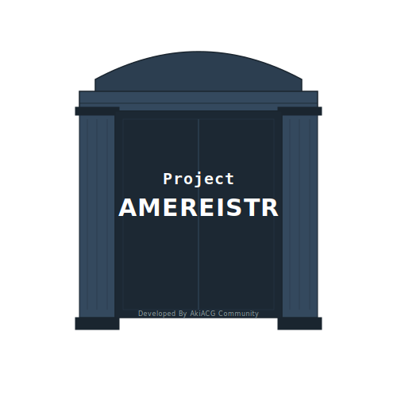

# Amereistr

  

Amereistr（基于AquaMai）是由 AkiACG 团队独立维护的实验性 Mod 分支。.

所有的门都关闭了。我们只是在做着自认为正确的事情然后圈地自萌。

## Installation

1. **Build the project** or grab a release from the [AkiACG Releases](/releases) (if available).
2. Download [MelonLoader v0.7.0+](https://github.com/LavaGang/MelonLoader/releases/download/v0.7.0/MelonLoader.x64.zip).
3. Extract MelonLoader zip to the directory containing `Sinmai.exe`.
4. Create a `Mods` folder and place the ***New*** `Amereistr.dll` inside it.

## Key Features

**Core & Compatibility**

* **Extended Support:** Fixed and maintained even when upstream says no.
* **Independent Logic:** Decoupled from Munet infrastructure.

## Development

1. Copy `Assembly-CSharp.dll` and `AMDaemon.NET.dll` to the `Libs` folder.
2. Install [.NET Framework 4.7.2 Developer Pack](https://dotnet.microsoft.com/en-us/download/dotnet-framework/thank-you/net472-developer-pack-offline-installer).
3. Run `build.ps1` (Ensure your build environment points to the new output path).
4. Copy `Output/Amereistr.dll` to your `Mods` folder.
5. Configure and copy `Amereistr.toml` to the same folder as `Sinmai.exe`.

## Credits & Links

* Based on AquaMai 1.7.5-9 (Original by Munet OSS).
* Refined and maintained by **AkiACG Team**.
* [MelonLoader Wiki](https://melonwiki.xyz/)
* [Harmony Docs](https://harmony.pardeike.net/articles/patching-prefix.html)
